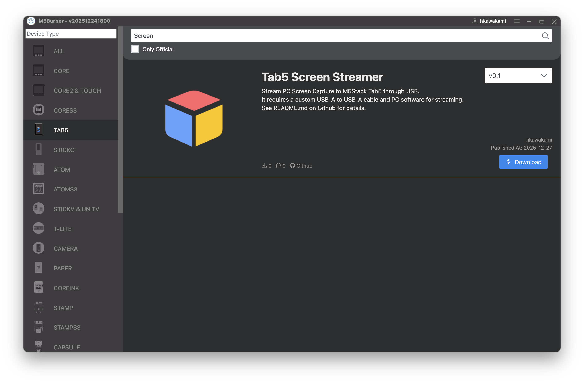

# Tab5-Screen-Streamer
Stream PC Screen Capture to M5Stack Tab5

## Download M5Stack Tab5 Firmware

Please use [M5Burner](https://docs.m5stack.com/en/uiflow/m5burner/intro) to download and flash M5Stack Firmware.



Share Code: `JB5LW1zphbars8tO`

## Prepare Custom USB Cable

M5Stack Tab5 only supports USB2.0 High Speed (480Mbps) communication through its USB-A port, so you need to connect it to your PC using a USB-A to USB-A cable.

### Option 1: Use a Commercial USB-A to USB-A Cable

You can use a commercially available USB-A male to USB-A male cable.  
For safety, it is recommended to mask the VBUS and GND pins with tape.

### Option 2: Combine a USB-A to USB-C Cable with an Adapter

You can use a standard USB Type-C cable (USB-A male to USB-C male) combined with a special USB-C adapter (USB-A male to USB-C female).  
For safety, it is recommended to mask the VBUS and GND pins with tape.

### Option 3: Make Your Own USB-A to USB-A Cable

Prepare two USB-A male connectors and connect only the D+ and D- pins.  
For more details, refer to [Espressif's documentation](https://github.com/espressif/esp-idf/tree/8f1e7bc4e08878f5a2aab55fdf302789d3a3eac4/examples/peripherals/usb).

### When Using PC's USB-C Port

When connecting from your PC's USB-C port to Tab5's USB-A port, you need to bypass the USB-C port's role detection.   
Use a USB-C male to USB-A female USB adapter first, then connect with a USB-A to USB-A cable.

## Streaming from PC

### macOS

Download the macOS streamer from the [GitHub Release page](https://github.com/Hiroki-Kawakami/Tab5-Screen-Streamer/releases).  
Launch tab5-screen-streamer with Tab5 connected, and the screen capture will be transmitted to Tab5.  
If you are prompted to select which screen to display on first launch, please restart tab5-screen-streamer after selecting the desired screen, as switching capture content may not work properly.

### Windows

You need to install the USB driver using [Zadig](https://zadig.akeo.ie).  
Launch Zadig, select "Tab5 Screen Streamer", and install the driver.

Download the Windows streamer from the [GitHub Release page](https://github.com/Hiroki-Kawakami/Tab5-Screen-Streamer/releases).  
Launch tab5-screen-streamer with Tab5 connected, and the screen capture will be transmitted to Tab5.  
For Windows, only screen mirroring is supported.

### Automatic Reconnection After Disconnection

tab5-screen-streamer will exit when communication with Tab5 is disconnected and will not automatically reconnect.  
You can enable automatic reconnection when Tab5 is reconnected by restarting the process on exit (e.g., using bash) combined with the `--wait-device` option to wait for device connection.

```bash
while true; do ./tab5-screen-streamer --wait-device; done
```
